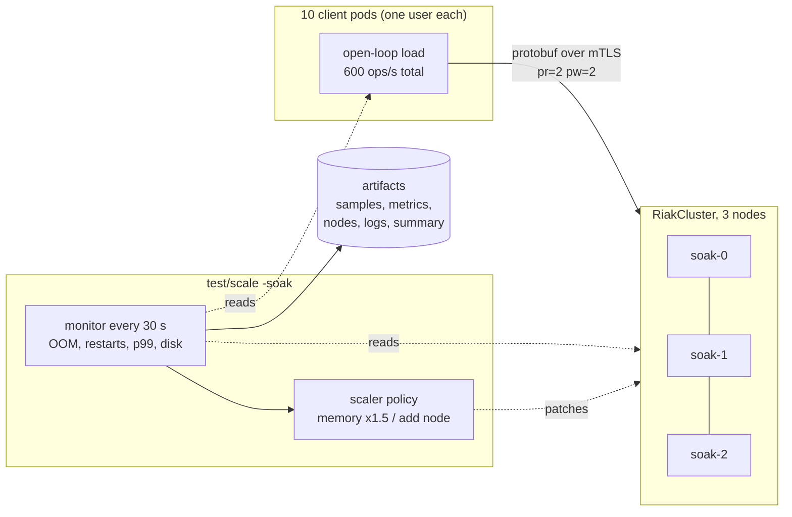

# Soak test results

A four-hour constant-load run against a three-node cluster on the test OKD cluster
(see [Test environment](test-environment.md)). The harness is `test/scale -soak`; how to run it and
what each flag does is in [Scaling](scaling.md#soak-test-a-constant-load-for-hours).

**Verdict: passed.** 600 ops/s of 128 KiB objects for 4 hours, no OOM kill, no container restart,
no scaling action needed, no lost or corrupt value.


## The run

| | |
|---|---|
| Date | 2026-10-07, 12:49 to 17:00 (CEST), 4 h of load plus ramp-up and read-back |
| Cluster | 3 Riak nodes, 16 GiB memory limit, 4 CPU request, no CPU limit, 300 GiB PVC each |
| Replication | `n_val` 3, `pr` 2, `pw` 2 |
| Load | 600 ops/s total, 50 % reads / 50 % writes, 128 KiB objects |
| Clients | 10 pods (one per user, mTLS client certificate), 16 threads each, 10 buckets |
| Network | 1 GbE per node (see [What the network allows](#what-the-network-allows)) |



## Throughput

The clients are open-loop: they issue requests on a schedule and do not slow down when Riak does,
so a dip here is Riak (or the network) falling behind, not the client backing off.


| | |
|---|---|
| Target | 600 ops/s |
| Average | 595.8 ops/s (99.3 %) |
| Lowest one-minute window | 536 ops/s |
| Windows at 95 % of target or better | 96.7 % |
| Operations | 8,579,991 (4,290,395 puts, 4,289,596 gets) |
| Errors | 200 read timeouts, 0.0023 % |

The ramp-up and wind-down windows are left out of the average and the minimum; a stall in the
middle of the run would not be.

## Latency


The chart shows the worst client's p99 in each one-minute window. The histogram counts those
windows.


| Worst-client p99 per window | |
|---|---|
| Median | 516 ms |
| 95th percentile | 997 ms |
| 99th percentile | 1,245 ms |
| Worst window | 1,936 ms |

Riak's own p99 (from its Prometheus metrics, worst node) follows what the clients see, so the
time is spent inside the cluster (disk and replica round trips on a shared 1 GbE network), not in
the client or the Service.


The single put p99 spike of about 4 s at roughly 0.7 h coincides with the memory spike below.

## Memory


Peak working set was 3.3 GiB of the 16 GiB limit (20.8 % at the busiest node), one transient
spike around 0.8 h. The scaler never had a reason to act.

## CPU


Riak has no CPU limit and shares the Kubernetes nodes with the platform. The nodes ran at
45 to 85 % total CPU, with `sm3` consistently lower.

## Disk


Peak 44.5 % of the 300 GiB volume. The data grows in a staircase rather than a line. Our working
hypothesis is XFS speculative preallocation combined with bitcask merges, but we did not verify
it. At the end of the run the apparent size was about 83 GiB, the allocated size 90 GiB and `df`
reported 108 GiB, so size your volumes from `df`, not from the data you wrote.

## Data integrity

| Check | Result |
|---|---|
| Lost writes | 0 |
| Corrupt values | 0 |
| Stale or ahead reads | 0 |
| Final read-back | 479,917 keys, 0 lost, 0 corrupt |
| Writes that timed out but landed anyway | 24 |
| Siblings seen | 55 |

A write that times out on the client may still be applied by Riak, so the client reports it as
`landed` rather than corrupt: the value was written by this run, just later than the client gave
up. These are expected with `pw=2` under load and are not failures.

## What the network allows

Each Riak node's NIC carries roughly 1.04 times the object size for every operation (the client
leg plus replication), and a 1 GbE port delivers about 90 MB/s in practice. That puts the ceiling
for 128 KiB objects near 650 ops/s per node link, which is why this run, at 600 ops/s, is close
to what this hardware can do.


| Run | Result |
|---|---|
| 16 KiB, 200 ops/s, 4 h | held |
| 500 KiB, 1000 ops/s | not feasible on 1 GbE; the measured ceiling was about 150 ops/s |
| 128 KiB, 600 ops/s, 4 h | held (this page) |

To reach 500 KiB at 1000 ops/s you need 10 GbE, smaller objects or a lower rate. The 10 GbE ports
on these nodes are not cabled.

## Caveats

- ACM, MCE and KubeVirt were removed from the cluster before this run to free CPU. The earlier
  16 KiB, 200 ops/s soak ran with them installed, so the two runs are not like for like.
- A `bench` namespace with another Riak cluster started on the same nodes around 14:12 to 14:21
  UTC, overlapping the last 30 minutes or so of load. Throughput and latency held anyway, but
  that stretch is not an isolated measurement.
- This is a single run on one cluster. It shows the operator and Riak sustain the load; it is not
  a benchmark of Riak's limits.

## Reproduce

```bash
# run the soak, then draw the charts from its artifact directory
python3 hack/soak-report.py ~/soak-results/<run> docs/assets/soak
```

The generator uses only the Python standard library and writes every chart in a light and a dark
variant. Its tests run with `make test-soak-report`.
